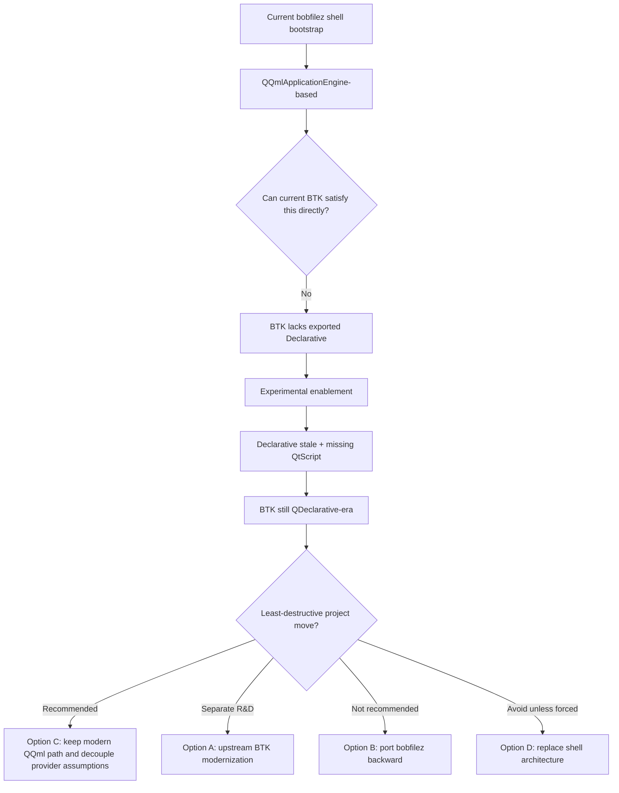

# BTK Native Framework Decision Matrix

## Purpose
This document converts the BTK provider probe series into a practical architecture decision.

The goal is to choose the least-destructive path forward for bobfilez's native shell/UI strategy after five rounds of BTK validation showed that the problem is no longer a simple build or package issue.

## Decision context
The current evidence establishes all of the following:

1. **BTK normal enabled modules can now build successfully on this MSVC host**
2. **bobfilez still cannot build its active native GUI against BTK because `Declarative` is not exported**
3. **BTK's `Declarative` module is stale/incomplete when experimentally re-enabled**
   - stale declarative-specific CMake integration
   - obsolete metatype declarations
   - missing QtScript-era dependencies
4. **BTK's declarative model is also the wrong generation**
   - BTK: `QDeclarative*`
   - bobfilez bootstrap: `QQml*`

So the next step is now a strategy choice, not another small compatibility patch.

## Active bobfilez assumption
Current native bootstrap (`gui/omni/src/main.cpp`) depends on:
- `QGuiApplication`
- `QQmlApplicationEngine`
- `QQmlContext`
- `qmlRegisterType(...)`

This makes bobfilez's active shell path a **modern QQml/QML-engine consumer**.

## Options considered

### Option A — Upstream BTK modernization to a real QQml/QQuick-class provider
**Description**
- Continue investing in BTK itself.
- Treat BTK as a strategic upstream project.
- Goal: evolve BTK from its current `QDeclarative*` / QtScript-era state toward a provider surface that can satisfy a `QQmlApplicationEngine`-style application.

**Requires**
- declarative CMake modernization
- declarative source modernization
- metatype modernization (`Q_DECLARE_METATYPE` → `CS_DECLARE_METATYPE` or equivalent)
- restoration/replacement/removal of the old QtScript/CsScript dependency chain
- likely new `QQml*` / `QQuick*`-class surface work or a compatibility layer

**Pros**
- preserves BTK as the long-term strategic native framework direction
- avoids abandoning current BTK investigation investment
- could eventually produce a tailored native stack for bobfilez and related ecosystem apps

**Cons**
- very high effort
- very high uncertainty
- requires upstream framework engineering rather than app integration work
- likely to stall bobfilez shell feature progress for a long time

### Option B — Port bobfilez backward from `QQml*` to BTK's `QDeclarative*` era
**Description**
- Adapt bobfilez's current native shell from modern `QQml*` engine APIs to the older `QDeclarative*` declarative stack BTK appears to expose.

**Requires**
- replacing `QQmlApplicationEngine`
- replacing or reworking modern QML registration/bootstrap assumptions
- validating all QML asset/runtime expectations against an older declarative engine model
- likely significant asset/runtime incompatibility work

**Pros**
- in theory aligns bobfilez to BTK's current declarative generation
- avoids first having to modernize BTK to `QQml*`

**Cons**
- likely extreme regression risk
- pushes bobfilez backward architecturally
- still blocked by BTK declarative incompleteness and QtScript gaps
- likely invalidates or complicates a large amount of existing shell work

### Option C — Keep bobfilez on a modern QQml-style shell path and decouple provider assumptions
**Description**
- Stop trying to force BTK to be the immediate runtime provider for the active shell.
- Preserve the evidence gathered.
- Keep bobfilez's shell/UI work aligned to a modern QQml-style architecture.
- Introduce a cleaner provider boundary / bootstrap abstraction so the project is less tightly coupled to any one provider naming scheme.
- Use BTK as a research branch, not as the current production-native dependency target.

**Requires**
- defining a provider-neutral GUI bootstrap boundary
- reducing direct framework assumptions in active GUI wiring where practical
- keeping BTK findings documented and honest
- potentially evaluating alternative modern QQml-capable provider strategies separately

**Pros**
- least disruptive to current bobfilez shell direction
- preserves current QML asset investment
- keeps feature work moving instead of converting the project into an upstream framework port
- compatible with future provider re-evaluation

**Cons**
- does not immediately deliver a BTK-backed native build
- requires accepting that BTK is currently a research/probe target, not the active provider
- may force a future provider choice if a modern compatible runtime is still required

### Option D — Replace the QML shell architecture entirely
**Description**
- Move away from a declarative/QML shell path altogether and rebuild the native shell using a different UI model.

**Requires**
- major rewrite of shell bootstrap and many UI surfaces
- loss or reimplementation of substantial QML asset work
- new UI architecture decision for the full explorer/shell experience

**Pros**
- avoids ongoing declarative/provider mismatch issues
- may align better with some native frameworks in the long run

**Cons**
- maximum product disruption
- highest shell feature regression risk on the app side
- throws away too much active progress too early

## Scoring matrix
Scale:
- **5 = best / lowest pain / highest fit**
- **1 = worst / highest pain / lowest fit**

| Criterion | Option A: Modernize BTK to QQml/QQuick-class provider | Option B: Port bobfilez backward to QDeclarative | Option C: Keep modern QQml path, decouple provider assumptions | Option D: Replace QML shell architecture entirely |
|---|---:|---:|---:|---:|
| Preserves current bobfilez shell work | 4 | 1 | 5 | 1 |
| Near-term delivery risk | 1 | 1 | 4 | 1 |
| Long-term framework coherence | 4 | 1 | 4 | 3 |
| Upstream engineering burden | 1 | 2 | 4 | 3 |
| App-side regression risk | 3 | 1 | 5 | 1 |
| Strategic optionality | 3 | 1 | 5 | 2 |
| Honest fit with current evidence | 3 | 1 | 5 | 3 |
| **Total** | **19** | **8** | **32** | **14** |

## Recommendation
### Primary recommendation: **Option C**
Keep bobfilez on a modern QQml-style shell path and decouple provider assumptions.

This is the least-destructive path because it:
- preserves the current shell/UI asset investment
- fits the actual architecture already in place
- avoids pretending BTK is ready when the evidence says it is not
- keeps future provider options open
- avoids converting bobfilez into a long-running upstream framework rescue effort

### Secondary strategic lane: **Option A as a separate upstream initiative**
BTK modernization should only continue if it is treated as its own serious framework project, not as a near-term unblock for bobfilez's active shell build.

In other words:
- **Option C is the app strategy**
- **Option A is the optional upstream R&D strategy**

## Explicit non-recommendations
### Do not choose Option B
Porting bobfilez backward to a `QDeclarative*` era stack is the worst of both worlds:
- it regresses bobfilez
- and it still does not avoid BTK declarative incompleteness

### Do not choose Option D unless forced later
A full QML-shell rewrite would destroy too much active progress before less destructive paths are exhausted.

## Recommended phased plan

### Phase 1 — Stabilize the decision boundary
1. Keep the BTK consumer failure explicit and honest.
2. Preserve the BTK probe documentation as the reference baseline.
3. Stop spending app-integration time on pretending `Declarative` is near-ready.

### Phase 2 — Reduce provider coupling in bobfilez
1. Isolate shell bootstrap/provider assumptions behind a smaller integration seam.
2. Keep active GUI code aligned to a modern QQml-style engine model.
3. Continue non-provider-blocked GUI work where valuable:
   - dependency reduction
   - asset cleanup
   - provider-neutral bridge organization

### Phase 3 — Decide on the long-term native runtime path
Choose one:
- a modern QQml-capable provider/runtime path for bobfilez
- or a dedicated upstream BTK modernization program with explicit scope and budget

## Mermaid decision flow

## Bottom line
The cleanest project decision today is:

- **Do not keep treating BTK as the immediate native provider for the active bobfilez shell**
- **Preserve bobfilez's modern QQml-style shell direction**
- **Use BTK modernization only as a separate upstream initiative if the project explicitly chooses to fund that effort**
